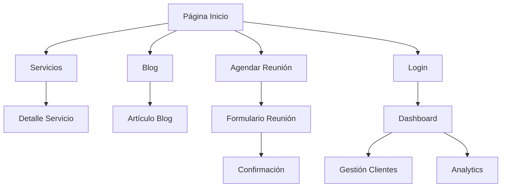

# V1tr0 - Documentación del Proyecto

## 1. Descripción General del Proyecto

V1tr0 es una aplicación web moderna desarrollada con Next.js 15, React 19 y TypeScript que ofrece servicios de consultoría tecnológica, desarrollo de software y gestión de proyectos. La plataforma incluye un sistema completo de gestión de reuniones, blog corporativo, portafolio de servicios y dashboard administrativo.

**Propósito Principal:** Proporcionar una plataforma integral para la empresa V1tr0 que permita mostrar servicios, gestionar clientes, agendar reuniones y mantener un blog técnico actualizado.

**Valor de Mercado:** Solución empresarial completa que combina marketing digital, gestión de clientes y herramientas administrativas en una sola plataforma.

## 2. Características Principales

### 2.1 Roles de Usuario

| Rol | Método de Registro | Permisos Principales |
|-----|-------------------|---------------------|
| Usuario Anónimo | No requiere registro | Navegar sitio web, ver blog, contactar |
| Usuario Autenticado | Email + contraseña via Supabase | Agendar reuniones, acceso a dashboard |
| Administrador | Acceso directo via Supabase | Gestión completa de contenido y usuarios |

### 2.2 Módulos Funcionales

La aplicación está estructurada en las siguientes páginas principales:

1. **Página de Inicio**: Hero section, navegación principal, servicios destacados, animaciones GSAP
2. **Páginas de Servicios**: Desarrollo de software, gestión de proyectos, sistemas de información, automatización
3. **Blog Corporativo**: Artículos técnicos con MDX, sistema de tags, navegación entre posts
4. **Sistema de Reuniones**: Calendario integrado, disponibilidad, confirmación automática
5. **Dashboard**: Panel administrativo para gestión de clientes y reuniones
6. **Autenticación**: Login/registro con Supabase, callbacks de OAuth
7. **Páginas Legales**: Términos, privacidad, cookies
8. **Portafolio**: Showcase de proyectos y casos de éxito

### 2.3 Detalles de Páginas

| Página | Módulo | Descripción de Funcionalidades |
|--------|--------|---------------------------------|
| Inicio | Hero Banner | Animaciones 3D con Three.js, slider GSAP, call-to-action |
| Inicio | Servicios | Grid de tecnologías, carruseles interactivos, modal de contacto |
| Servicios | Desarrollo Software | Portafolio de proyectos, tecnologías utilizadas, casos de éxito |
| Servicios | Gestión Proyectos | Metodologías, herramientas, proceso de trabajo |
| Blog | Lista de Posts | Filtrado por tags, paginación, búsqueda |
| Blog | Detalle Post | Contenido MDX, tabla de contenidos, navegación entre posts |
| Reuniones | Calendario | Integración Google Calendar, slots disponibles, zona horaria |
| Reuniones | Formulario | Validación con Zod, confirmación email, datos del cliente |
| Dashboard | Gestión Clientes | CRUD completo, filtros, exportación |
| Dashboard | Analytics | Métricas de reuniones, gráficos con Recharts |
| Auth | Login/Register | Supabase Auth, validación formularios, redirección |

## 3. Flujo Principal de Usuario

### Flujo de Usuario Anónimo
1. Usuario visita la página de inicio
2. Navega por servicios y portafolio
3. Lee artículos del blog
4. Utiliza formulario de contacto o agenda reunión
5. Recibe confirmación por email

### Flujo de Usuario Autenticado
1. Usuario se registra/inicia sesión
2. Accede al dashboard personalizado
3. Gestiona sus reuniones agendadas
4. Ve historial de interacciones
5. Actualiza perfil y preferencias

### Flujo de Administrador
1. Acceso directo al panel administrativo
2. Gestiona contenido del blog
3. Supervisa reuniones y clientes
4. Configura disponibilidad del calendario
5. Genera reportes y analytics



## 4. Diseño de Interfaz de Usuario

### 4.1 Estilo de Diseño

- **Colores Primarios**: 
  - Primario: `#0070f3` (Azul corporativo)
  - Secundario: `#7c3aed` (Púrpura)
  - Acento: `#10b981` (Verde)
  - Neutros: Escala de grises con `#f8fafc` a `#1e293b`

- **Tipografía**: 
  - Fuente principal: Geist (optimizada por Vercel)
  - Tamaños: 14px (texto), 16px (párrafos), 24px+ (títulos)
  - Peso: 400 (normal), 500 (medium), 700 (bold)

- **Estilo de Botones**: Redondeados con `border-radius: 8px`, efectos hover suaves

- **Layout**: 
  - Diseño basado en cards con sombras sutiles
  - Navegación superior fija con scroll suave
  - Grid responsivo con Tailwind CSS
  - Animaciones fluidas con GSAP y Framer Motion

- **Iconografía**: 
  - Lucide React para iconos generales
  - Heroicons para elementos de interfaz
  - Iconos personalizados para redes sociales

### 4.2 Resumen de Diseño por Página

| Página | Módulo | Elementos UI |
|--------|--------|--------------|
| Inicio | Hero Section | Fondo animado, logo 3D, gradientes, botones CTA prominentes |
| Inicio | Servicios | Cards con hover effects, iconos coloridos, layout grid responsivo |
| Blog | Lista Posts | Cards con imágenes, tags coloridos, paginación minimalista |
| Blog | Detalle | Tipografía optimizada, tabla de contenidos flotante, navegación |
| Reuniones | Calendario | Componente calendario personalizado, slots interactivos |
| Dashboard | Analytics | Gráficos con Recharts, tablas con filtros, métricas destacadas |

### 4.3 Responsividad

- **Enfoque**: Mobile-first con adaptación progresiva
- **Breakpoints**: 
  - Mobile: 320px - 768px
  - Tablet: 768px - 1024px  
  - Desktop: 1024px+
- **Optimización táctil**: Botones mínimo 44px, gestos swipe en carruseles
- **Performance**: Lazy loading de imágenes, code splitting por rutas

## 5. Tecnologías y Dependencias

### 5.1 Stack Principal
- **Frontend**: React 19.1.1 + Next.js 15.5.0 + TypeScript 5
- **Styling**: Tailwind CSS 3.4.17 + Tailwind Animate
- **UI Components**: Radix UI + shadcn/ui
- **Animaciones**: GSAP 3.13.0 + Framer Motion 11.11.17
- **3D Graphics**: Three.js 0.179.0 + React Three Fiber

### 5.2 Backend y Servicios
- **Base de Datos**: Supabase (PostgreSQL)
- **Autenticación**: Supabase Auth
- **Email**: Nodemailer 7.0.5
- **APIs Externas**: Google Calendar API, Google OAuth

### 5.3 Herramientas de Desarrollo
- **Linting**: ESLint 9.33.0 + ESLint Config Next
- **Bundling**: Vite (integrado en Next.js)
- **Validación**: Zod 3.24.1
- **Formularios**: React Hook Form 7.54.1

## 6. Estructura del Proyecto

```
frontend/
├── app/                    # App Router de Next.js 15
│   ├── (auth)/            # Grupo de rutas de autenticación
│   ├── (dashboard)/       # Grupo de rutas del dashboard
│   ├── (marketing)/       # Grupo de rutas públicas
│   ├── api/               # API Routes
│   └── globals.css        # Estilos globales
├── components/            # Componentes React reutilizables
│   ├── ui/               # Componentes base (shadcn/ui)
│   ├── home/             # Componentes específicos del home
│   ├── blog/             # Componentes del blog
│   ├── auth/             # Componentes de autenticación
│   └── global/           # Componentes globales
├── hooks/                # Custom React hooks
├── lib/                  # Utilidades y configuraciones
│   ├── supabase/         # Cliente de Supabase
│   ├── auth/             # Lógica de autenticación
│   └── utils/            # Funciones utilitarias
├── content/              # Contenido MDX del blog
├── public/               # Assets estáticos
└── styles/               # Estilos adicionales
```

## 7. APIs y Endpoints

### 7.1 API Routes Principales

| Endpoint | Método | Propósito |
|----------|--------|-----------|
| `/api/meetings` | GET, POST | Gestión de reuniones |
| `/api/calendar-availability` | GET | Consultar disponibilidad |
| `/api/schedule-meeting` | POST | Agendar nueva reunión |
| `/api/contact` | POST | Formulario de contacto |
| `/api/unified-contact` | POST | Contacto unificado |
| `/api/clients` | GET, POST, PUT, DELETE | CRUD de clientes |

### 7.2 Integración con Supabase

**Tablas Principales:**
- `meetings`: Gestión de citas y reuniones
- `clients`: Información de clientes
- `auth.users`: Usuarios autenticados (Supabase Auth)

**Configuración de Seguridad:**
- Row Level Security (RLS) habilitado
- Políticas de acceso por rol de usuario
- Autenticación JWT con Supabase

## 8. Configuración y Variables de Entorno

### 8.1 Variables Requeridas

```env
# Supabase
NEXT_PUBLIC_SUPABASE_URL=your_supabase_url
NEXT_PUBLIC_SUPABASE_ANON_KEY=your_supabase_anon_key
SUPABASE_SERVICE_ROLE_KEY=your_service_role_key

# Google APIs
GOOGLE_CLIENT_ID=your_google_client_id
GOOGLE_CLIENT_SECRET=your_google_client_secret
GOOGLE_REFRESH_TOKEN=your_refresh_token

# Email
SMTP_HOST=your_smtp_host
SMTP_PORT=587
SMTP_USER=your_email
SMTP_PASS=your_password

# App
NEXTAUTH_URL=http://localhost:3000
NEXTAUTH_SECRET=your_nextauth_secret
```

### 8.2 Configuración de Desarrollo

1. **Instalación de dependencias:**
   ```bash
   npm install
   ```

2. **Configuración de variables de entorno:**
   ```bash
   cp .env.example .env.local
   # Editar .env.local con tus credenciales
   ```

3. **Configuración de Supabase:**
   ```bash
   # Ejecutar el script SQL de configuración
   psql -h your_host -d your_db -f supabase-setup.sql
   ```

4. **Iniciar servidor de desarrollo:**
   ```bash
   npm run dev
   ```

## 9. Guía de Despliegue

### 9.1 Preparación para Producción

1. **Build del proyecto:**
   ```bash
   npm run build
   ```

2. **Verificar build:**
   ```bash
   npm run start
   ```

### 9.2 Despliegue en Vercel (Recomendado)

1. Conectar repositorio con Vercel
2. Configurar variables de entorno en el dashboard
3. Despliegue automático en cada push a main

### 9.3 Consideraciones de Producción

- **Performance**: Optimización de imágenes habilitada
- **SEO**: Meta tags dinámicos, sitemap automático
- **Analytics**: Integración con Google Analytics (opcional)
- **Monitoring**: Error tracking con Sentry (opcional)

## 10. Mantenimiento y Actualizaciones

### 10.1 Actualizaciones Regulares
- Dependencias de seguridad: Mensual
- Framework (Next.js): Cada versión LTS
- Componentes UI: Según necesidades

### 10.2 Backup y Recuperación
- Base de datos: Backup automático de Supabase
- Código: Versionado en Git
- Assets: CDN con respaldo

### 10.3 Monitoreo
- Logs de aplicación via Vercel
- Métricas de performance via Web Vitals
- Uptime monitoring recomendado

---

**Última actualización:** Enero 2025  
**Versión del proyecto:** 0.1.0  
**Mantenido por:** Equipo V1tr0