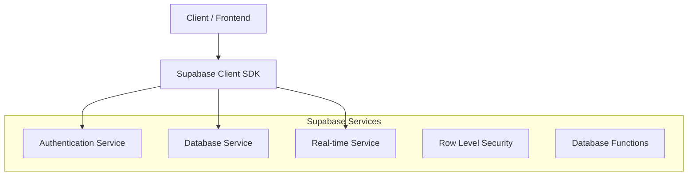
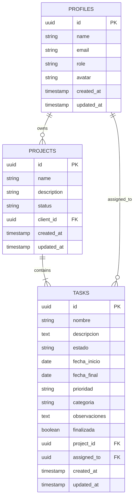

# Arquitectura Técnica - Sistema de Autenticación con Roles

## 1. Architecture Design

```mermaid
graph TD
  A[User Browser] --> B[React Frontend Application]
  B --> C[Supabase SDK]
  C --> D[Supabase Service]
  
  subgraph "Frontend Layer"
    B
    E[Auth Context]
    F[Role-based Routing]
    G[Dashboard Components]
    H[Timeline Components]
  end
  
  subgraph "Service Layer (Provided by Supabase)"
    D
    I[Authentication]
    J[Database (PostgreSQL)]
    K[Real-time Subscriptions]
  end
```

## 2. Technology Description

- Frontend: React@18 + TypeScript + tailwindcss@3 + vite
- Backend: Supabase (Authentication + Database)
- State Management: React Context + useState/useEffect
- UI Components: shadcn/ui + Lucide React icons
- Animations: GSAP (existing)

## 3. Route Definitions

| Route | Purpose |
|-------|----------|
| /login | Login page with role validation and redirection |
| /client-dashboard | Client dashboard with projects, profile, and settings |
| /client-dashboard/projects | Projects overview for clients |
| /client-dashboard/projects/[id] | Individual project timeline view |
| /client-dashboard/profile | Client profile management |
| /client-dashboard/settings | Client account settings |
| /dashboard | Admin dashboard (existing) |
| /dashboard/projects | Admin project management |
| /dashboard/users | Admin user management |

## 4. API Definitions

### 4.1 Authentication API

**Login with Role Validation**
```typescript
POST /auth/signInWithPassword
```

Request:
| Param Name | Param Type | isRequired | Description |
|------------|------------|------------|-------------|
| email | string | true | User email address |
| password | string | true | User password |

Response:
| Param Name | Param Type | Description |
|------------|------------|-------------|
| user | User | Authenticated user object |
| session | Session | User session with tokens |

### 4.2 Profile API

**Get User Profile with Role**
```typescript
GET /rest/v1/profiles?select=*&id=eq.{user_id}
```

Response:
| Param Name | Param Type | Description |
|------------|------------|-------------|
| id | uuid | User ID |
| name | string | User full name |
| email | string | User email |
| role | string | User role (client/admin) |
| avatar | string | Avatar URL |
| created_at | timestamp | Account creation date |

### 4.3 Projects API

**Get Client Projects**
```typescript
GET /rest/v1/projects?select=*&client_id=eq.{user_id}
```

Response:
| Param Name | Param Type | Description |
|------------|------------|-------------|
| id | uuid | Project ID |
| name | string | Project name |
| description | string | Project description |
| status | string | Project status |
| client_id | uuid | Client user ID |
| created_at | timestamp | Project creation date |

### 4.4 Tasks API

**Get Project Tasks**
```typescript
GET /rest/v1/tasks?select=*&project_id=eq.{project_id}
```

Response:
```json
{
  "tasks": [
    {
      "id": 1,
      "nombre": "Definir arquitectura del sistema",
      "descripcion": "Crear diagrama de arquitectura y definir tecnologías",
      "estado": "completada",
      "fecha_inicio": "2024-01-01",
      "fecha_final": "2024-01-05",
      "prioridad": "alta",
      "categoria": "planeacion",
      "observaciones": "Arquitectura aprobada por el cliente",
      "finalizada": true,
      "project_id": "uuid"
    }
  ]
}
```

## 5. Server Architecture Diagram



## 6. Data Model

### 6.1 Data Model Definition



### 6.2 Data Definition Language

**Profiles Table (existing - add role column if not exists)**
```sql
-- Add role column to existing profiles table
ALTER TABLE profiles ADD COLUMN IF NOT EXISTS role VARCHAR(20) DEFAULT 'client' CHECK (role IN ('client', 'admin'));

-- Create index for role-based queries
CREATE INDEX IF NOT EXISTS idx_profiles_role ON profiles(role);

-- Grant permissions
GRANT SELECT ON profiles TO anon;
GRANT ALL PRIVILEGES ON profiles TO authenticated;
```

**Projects Table**
```sql
-- Create projects table
CREATE TABLE IF NOT EXISTS projects (
    id UUID PRIMARY KEY DEFAULT gen_random_uuid(),
    name VARCHAR(255) NOT NULL,
    description TEXT,
    status VARCHAR(50) DEFAULT 'active' CHECK (status IN ('active', 'completed', 'paused', 'cancelled')),
    client_id UUID REFERENCES profiles(id) ON DELETE CASCADE,
    created_at TIMESTAMP WITH TIME ZONE DEFAULT NOW(),
    updated_at TIMESTAMP WITH TIME ZONE DEFAULT NOW()
);

-- Create indexes
CREATE INDEX idx_projects_client_id ON projects(client_id);
CREATE INDEX idx_projects_status ON projects(status);

-- Grant permissions
GRANT SELECT ON projects TO anon;
GRANT ALL PRIVILEGES ON projects TO authenticated;

-- Row Level Security
ALTER TABLE projects ENABLE ROW LEVEL SECURITY;

-- Policy: Users can only see their own projects
CREATE POLICY "Users can view own projects" ON projects
    FOR SELECT USING (auth.uid() = client_id OR 
                     (SELECT role FROM profiles WHERE id = auth.uid()) = 'admin');
```

**Tasks Table**
```sql
-- Create tasks table
CREATE TABLE IF NOT EXISTS tasks (
    id UUID PRIMARY KEY DEFAULT gen_random_uuid(),
    nombre VARCHAR(255) NOT NULL,
    descripcion TEXT,
    estado VARCHAR(50) DEFAULT 'pendiente' CHECK (estado IN ('completada', 'en progreso', 'pendiente')),
    fecha_inicio DATE,
    fecha_final DATE,
    prioridad VARCHAR(20) DEFAULT 'media' CHECK (prioridad IN ('alta', 'media', 'baja')),
    categoria VARCHAR(50) NOT NULL CHECK (categoria IN ('planeacion', 'diseño', 'desarrollo', 'testing', 'despliegue')),
    observaciones TEXT,
    finalizada BOOLEAN DEFAULT FALSE,
    project_id UUID REFERENCES projects(id) ON DELETE CASCADE,
    assigned_to UUID REFERENCES profiles(id),
    created_at TIMESTAMP WITH TIME ZONE DEFAULT NOW(),
    updated_at TIMESTAMP WITH TIME ZONE DEFAULT NOW()
);

-- Create indexes
CREATE INDEX idx_tasks_project_id ON tasks(project_id);
CREATE INDEX idx_tasks_categoria ON tasks(categoria);
CREATE INDEX idx_tasks_estado ON tasks(estado);
CREATE INDEX idx_tasks_fecha_inicio ON tasks(fecha_inicio);

-- Grant permissions
GRANT SELECT ON tasks TO anon;
GRANT ALL PRIVILEGES ON tasks TO authenticated;

-- Row Level Security
ALTER TABLE tasks ENABLE ROW LEVEL SECURITY;

-- Policy: Users can only see tasks from their projects
CREATE POLICY "Users can view project tasks" ON tasks
    FOR SELECT USING (
        EXISTS (
            SELECT 1 FROM projects 
            WHERE projects.id = tasks.project_id 
            AND (projects.client_id = auth.uid() OR 
                 (SELECT role FROM profiles WHERE id = auth.uid()) = 'admin')
        )
    );

-- Insert sample data
INSERT INTO projects (name, description, status, client_id) VALUES
('Desarrollo Web V1TR0', 'Proyecto de desarrollo web completo', 'active', 
 (SELECT id FROM profiles WHERE email = 'cliente@ejemplo.com' LIMIT 1));

INSERT INTO tasks (nombre, descripcion, estado, fecha_inicio, fecha_final, prioridad, categoria, observaciones, finalizada, project_id) VALUES
('Definir arquitectura', 'Crear diagrama de arquitectura del sistema', 'completada', '2024-01-01', '2024-01-05', 'alta', 'planeacion', 'Arquitectura aprobada', true,
 (SELECT id FROM projects WHERE name = 'Desarrollo Web V1TR0' LIMIT 1)),
('Diseño de wireframes', 'Crear wireframes de todas las páginas', 'en progreso', '2024-01-06', '2024-01-15', 'alta', 'diseño', 'En revisión con cliente', false,
 (SELECT id FROM projects WHERE name = 'Desarrollo Web V1TR0' LIMIT 1)),
('Desarrollo frontend', 'Implementar componentes React', 'pendiente', '2024-01-16', '2024-02-15', 'alta', 'desarrollo', 'Pendiente aprobación de diseños', false,
 (SELECT id FROM projects WHERE name = 'Desarrollo Web V1TR0' LIMIT 1));
```

## 7. Component Structure

### 7.1 Authentication Components
- `AuthProvider`: Context provider for authentication state
- `ProtectedRoute`: Route wrapper with role validation
- `LoginForm`: Enhanced login with role redirection

### 7.2 Dashboard Components
- `ClientDashboard`: Main client dashboard layout
- `ProjectsGrid`: Grid of client projects
- `ProjectCard`: Individual project card component
- `ProfileSection`: User profile display and editing
- `SettingsPanel`: Client settings management

### 7.3 Timeline Components
- `ProjectTimeline`: Main timeline container
- `TimelineStage`: Individual stage component (planeacion, diseño, etc.)
- `TaskCard`: Task display component
- `TaskModal`: Detailed task view
- `ProgressIndicator`: Visual progress representation

### 7.4 Shared Components
- `NavBar`: Enhanced with role-based navigation
- `Sidebar`: Dashboard navigation sidebar
- `LoadingSpinner`: Consistent loading states
- `ErrorBoundary`: Error handling wrapper