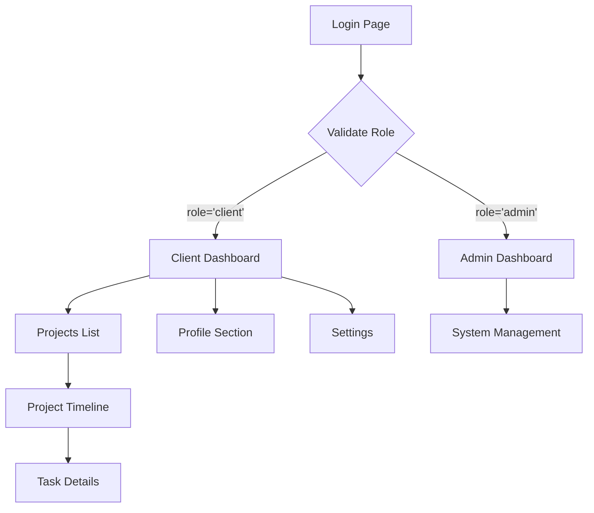

# Sistema de Autenticación con Roles y Dashboard de Cliente

## 1. Product Overview
Sistema de autenticación avanzado que valida roles de usuario desde la tabla profiles y redirige a dashboards específicos según el tipo de usuario (cliente o administrador).

- Soluciona la necesidad de acceso diferenciado según el rol del usuario, proporcionando experiencias personalizadas para clientes y administradores.
- Los clientes podrán gestionar sus proyectos activos con V1TR0 a través de un timeline interactivo de desarrollo.
- El sistema optimiza la gestión de proyectos mediante visualización clara de etapas y tareas organizadas por categorías.

## 2. Core Features

### 2.1 User Roles

| Role | Registration Method | Core Permissions |
|------|---------------------|------------------|
| Client | Email registration + profile validation | Acceso a dashboard de cliente, gestión de proyectos asignados, visualización de timeline |
| Admin | Invitation code + admin privileges | Acceso completo al dashboard administrativo, gestión de todos los proyectos y usuarios |

### 2.2 Feature Module

Nuestro sistema de autenticación con roles consiste en las siguientes páginas principales:

1. **Login Page**: validación de credenciales, verificación de rol en tabla profiles, redirección automática según rol
2. **Client Dashboard**: proyectos activos, perfil de usuario, configuración personal
3. **Project Timeline**: línea de tiempo vertical, etapas de desarrollo, gestión de tareas por categoría
4. **Admin Dashboard**: gestión completa de proyectos, usuarios y configuraciones del sistema
5. **Profile Management**: edición de información personal, configuración de preferencias

### 2.3 Page Details

| Page Name | Module Name | Feature description |
|-----------|-------------|---------------------|
| Login Page | Authentication Validator | Validate credentials, check profiles.role column, redirect to /client-dashboard if role='client' or /dashboard if role='admin' |
| Client Dashboard | Projects Overview | Display active projects with V1TR0, project cards with click navigation to timeline |
| Client Dashboard | Profile Section | Show user information, avatar, contact details, role status |
| Client Dashboard | Settings Module | Personal configuration, notification preferences, account settings |
| Project Timeline | Vertical Timeline | Display development stages: planeación, diseño, desarrollo, testing, despliegue |
| Project Timeline | Task Management | Show tasks by category, status indicators (completada, en progreso, pendiente), priority levels |
| Project Timeline | Task Details | Display task information: nombre, descripción, fechas, prioridad, observaciones |
| Admin Dashboard | System Management | Complete project and user management, system configuration access |
| Profile Management | User Information | Edit personal data, update avatar, change contact information |

## 3. Core Process

**Flujo de Autenticación:**
1. Usuario ingresa credenciales en login
2. Sistema valida credenciales contra Supabase Auth
3. Sistema consulta tabla profiles para obtener el rol del usuario
4. Si role = 'client': redirección a /client-dashboard
5. Si role = 'admin': redirección a /dashboard

**Flujo del Cliente:**
1. Acceso al dashboard de cliente
2. Visualización de proyectos activos con V1TR0
3. Selección de proyecto específico
4. Navegación al timeline vertical del proyecto
5. Exploración de etapas y tareas organizadas por categoría
6. Gestión de perfil y configuraciones personales

**Flujo del Administrador:**
1. Acceso al dashboard administrativo
2. Gestión completa de proyectos y usuarios
3. Configuración del sistema
4. Supervisión de todos los timelines de proyectos



## 4. User Interface Design

### 4.1 Design Style

- **Colores primarios**: #08A696 (verde principal), #26FFDF (verde claro/accent)
- **Colores secundarios**: #02505931 (verde oscuro/backgrounds), tonos de gris para texto
- **Estilo de botones**: Redondeados (rounded-xl), efectos de hover suaves, gradientes sutiles
- **Tipografía**: Inter o similar, tamaños 14px-16px para texto, 24px-32px para títulos
- **Layout**: Card-based design, navegación superior fija, sidebar para dashboards
- **Iconos**: Lucide React icons, estilo minimalista, colores consistentes con la paleta

### 4.2 Page Design Overview

| Page Name | Module Name | UI Elements |
|-----------|-------------|-------------|
| Login Page | Authentication Form | Fondo gradiente, formulario centrado con backdrop-blur, inputs con rounded-xl, botón principal con gradiente |
| Client Dashboard | Projects Grid | Cards con hover effects, gradientes sutiles, iconos de estado, navegación con breadcrumbs |
| Project Timeline | Vertical Timeline | Línea vertical con conectores, cards por etapa, indicadores de progreso, colores por categoría |
| Task Cards | Task Information | Cards compactas, badges de estado, iconos de prioridad, fechas destacadas |
| Profile Section | User Information | Avatar circular, formularios estilizados, botones de acción secundarios |

### 4.3 Responsiveness

Diseño mobile-first con adaptación completa para desktop. Timeline vertical se mantiene en móvil, dashboard usa grid responsivo, navegación se convierte en hamburger menu en pantallas pequeñas.

## 5. Data Structure

### 5.1 Task JSON Format

```json
{
  "tareas": [
    {
      "id": 1,
      "nombre": "Tarea 1",
      "descripcion": "Descripción de la tarea 1",
      "estado": "completada",
      "fecha_inicio": "2023-01-01",
      "fecha_final": "2023-01-05",
      "prioridad": "alta",
      "categoria": "planeacion",
      "observaciones": "Tarea 1 es una tarea importante",
      "finalizada": true
    }
  ]
}
```

### 5.2 Categories and Organization

- **Categorías**: planeacion, diseño, desarrollo, testing, despliegue
- **Estados**: completada, en progreso, pendiente
- **Prioridades**: alta, media, baja
- **Organización**: La categoría define la ubicación en el timeline, la fecha define el orden de las tareas dentro de cada categoría