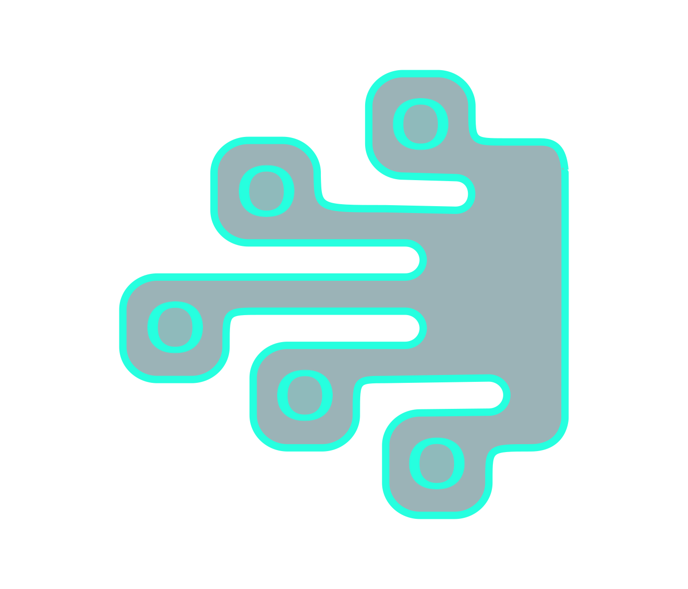

# 📚 V1TR0 Technologies - Manual de Usuario

## 📋 Tabla de Contenidos

- [🏁 Inicio Rápido](#-inicio-rápido)
- [🌐 Navegación del Sitio Web](#-navegación-del-sitio-web)
- [🎨 Personalización de Temas](#-personalización-de-temas)
- [📊 Uso del Dashboard](#-uso-del-dashboard)
- [📅 Gestión del Calendario](#-gestión-del-calendario)
- [👥 Administración de Clientes](#-administración-de-clientes)
- [📋 Gestión de Proyectos](#-gestión-de-proyectos)
- [✅ Administración de Tareas](#-administración-de-tareas)
- [📱 Uso en Dispositivos Móviles](#-uso-en-dispositivos-móviles)
- [❓ Preguntas Frecuentes](#-preguntas-frecuentes)
- [🆘 Soporte y Ayuda](#-soporte-y-ayuda)

---

## 🏁 Inicio Rápido

### ✨ Bienvenido a V1TR0 Technologies

V1TR0 Technologies es tu plataforma integral para la gestión de proyectos y servicios de desarrollo. Este manual te guiará paso a paso para aprovechar al máximo todas las funcionalidades.

### 🚀 Acceso Inicial

1. **Abre tu navegador** y navega a `http://localhost:3000`
2. **Explora la página principal** con nuestros servicios destacados
3. **Accede al dashboard** haciendo clic en "Dashboard" en el menú
4. **Personaliza tu experiencia** con el toggle de tema claro/oscuro

---

## 🌐 Navegación del Sitio Web

### 🏠 Página Principal

La página de inicio presenta:

#### 🎯 Banner Principal
- **Título impactante**: "Transformamos tu potencial en innovación y resultados"
- **Badge distintivo**: V1TR0 Technologies con efectos visuales modernos
- **Descripción**: Información sobre nuestro enfoque transparente

#### 🛠️ Servicios Destacados
Tres cards principales con efectos glassmorphism:

1. **🔧 Desarrollo de Software a Medida**
   - Soluciones personalizadas
   - Tecnologías modernas
   - Escalabilidad garantizada

2. **📊 Análisis y Visualización de Datos**
   - Insights accionables
   - Dashboards interactivos
   - Reportes automatizados

3. **📋 Creación y Gestión de Proyectos**
   - Metodologías ágiles
   - Seguimiento en tiempo real
   - Entrega puntual

#### 💻 Sección de Tecnologías
Grid interactivo con nuestras especialidades:
- **Frontend**: React, Next.js, TypeScript, Tailwind CSS
- **Backend**: Node.js, Python
- **Bases de Datos**: PostgreSQL, MongoDB, AWS, Cloudflare
- **DevOps**: Docker, AWS, CI/CD, Git
- **Mobile**: React Native, iOS, Android
- **Ciencia de Datos**: Python, R, Tableau, Power BI

**💡 Tip**: Haz clic en cualquier tecnología para ver detalles expandidos en un modal elegante.

### 📖 Páginas Adicionales

#### ℹ️ Sobre Nosotros (`/about`)
- Historia de la empresa
- Misión y visión
- Equipo de trabajo
- Valores corporativos

#### 💼 Servicios (`/services`)
- Desarrollo web y móvil
- Consultoría tecnológica
- Análisis de datos
- Gestión de proyectos

#### 🎨 Portafolio (`/portfolio`)
- Proyectos destacados
- Casos de estudio
- Testimonios de clientes

#### 📝 Blog (`/blog`)
- Artículos técnicos
- Tendencias de la industria
- Tutoriales y guías

---

## 🎨 Personalización de Temas

### 🌙 Modo Oscuro vs Claro

V1TR0 Technologies incluye un sistema de temas completo:

#### 🔄 Cambio de Tema
1. **Localiza el toggle** en la esquina superior derecha
2. **Haz clic** en el icono de sol/luna
3. **El cambio es instantáneo** y se guarda automáticamente

#### 🌅 Tema Claro
- **Colores**: Verde azulado (#08A696) como principal
- **Fondos**: Blancos y verdes muy claros
- **Contraste**: Optimizado para uso diurno
- **Legibilidad**: Máxima claridad en texto

#### 🌙 Tema Oscuro
- **Colores**: Cian brillante (#26FFDF) como principal
- **Fondos**: Verdes oscuros translúcidos
- **Contraste**: Suave para los ojos
- **Ambiente**: Profesional y moderno

#### ✨ Efectos Visuales
- **Glassmorphism**: Fondos translúcidos con blur
- **Gradientes dinámicos**: Cambian según el tema
- **Sombras adaptativas**: Se ajustan al contexto
- **Transiciones suaves**: 300ms de duración

---

## 📊 Uso del Dashboard

### 🏢 Acceso al Dashboard

1. **Navega** a `/dashboard` o haz clic en "Dashboard" en el menú
2. **Observa la vista general** con métricas principales
3. **Explora las secciones** usando la barra lateral

### 📈 Vista General

El dashboard principal muestra:

#### 📊 Métricas Clave
- **Total Proyectos**: Contador general con tendencia
- **Proyectos Activos**: En desarrollo actualmente  
- **Clientes**: Número total de clientes activos
- **Completados**: Proyectos finalizados este mes

#### 🎯 Tarjetas de Estado
Cada métrica se presenta en una card con:
- **Número principal**: Valor actual
- **Tendencia**: Cambio respecto al período anterior
- **Icono descriptivo**: Visual representativo
- **Color temático**: Adaptado al tema actual

#### 📱 Diseño Responsive
- **Desktop**: Grid de 4 columnas
- **Tablet**: Grid de 2 columnas
- **Mobile**: Columna única apilada

### 🧭 Navegación Lateral

#### 📋 Secciones Disponibles
- 🏠 **Dashboard**: Vista general
- 📅 **Calendario**: Gestión de fechas y tareas
- 👥 **Clientes**: Administración de clientes
- 📂 **Proyectos**: Gestión de proyectos
- ✅ **Tareas**: Administración de tareas

#### 📱 Responsive Sidebar
- **Desktop**: Siempre visible lateralmente
- **Mobile**: Collapsible con botón hamburguesa
- **Smooth transitions**: Animaciones fluidas

---

## 📅 Gestión del Calendario

### 📆 Vista del Calendario

El calendario integra gestión de tareas con una interfaz intuitiva:

#### 🗓️ Funcionalidades Principales
- **Vista mensual**: Navegación por meses
- **Indicadores visuales**: Días con tareas marcados
- **Selección de fecha**: Click para ver tareas del día
- **Modal de detalles**: Vista expandida por fecha

### ➕ Crear Nueva Tarea

#### 📝 Formulario de Tarea
1. **Haz clic** en "Añadir Tarea" o en una fecha específica
2. **Completa los campos obligatorios**:
   - **Título**: Nombre descriptivo de la tarea
   - **Descripción**: Detalles adicionales
   - **Proyecto**: Selecciona de la lista desplegable
   - **Asignado a**: Miembro del equipo responsable
   - **Prioridad**: Alta, Media o Baja
   - **Fecha**: Fecha de vencimiento
   - **Estado**: Pendiente, En Progreso, Completada

#### ✅ Validaciones
- **Campos requeridos**: Título y proyecto son obligatorios
- **Formato de fecha**: Validación automática
- **Límites de texto**: Títulos hasta 100 caracteres

### 📋 Gestión de Tareas

#### 🔍 Vista por Fecha
- **Lista filtrada**: Solo tareas de la fecha seleccionada
- **Estados visuales**: Colores según prioridad y estado
- **Acciones rápidas**: Marcar como completada, editar, eliminar

#### 🎨 Códigos de Color
- **🔴 Alta prioridad**: Borde rojo
- **🟡 Media prioridad**: Borde amarillo  
- **🟢 Baja prioridad**: Borde verde
- **✅ Completada**: Texto tachado y opacidad reducida

#### ⚡ Acciones Rápidas
- **Toggle completado**: Click en checkbox
- **Editar**: Click en icono de lápiz
- **Eliminar**: Click en icono de basura con confirmación

### 💾 Persistencia de Datos

- **Almacenamiento local**: Todas las tareas se guardan en localStorage
- **Sincronización automática**: Cambios guardados instantáneamente
- **Recuperación**: Datos mantenidos entre sesiones

---

## 👥 Administración de Clientes

### 📇 Lista de Clientes

#### 🔍 Vista General
- **Tabla responsive**: Lista completa de clientes
- **Información clave**: Nombre, empresa, email, teléfono
- **Acciones rápidas**: Editar, ver detalles, eliminar
- **Búsqueda**: Filtrado en tiempo real

### ➕ Agregar Nuevo Cliente

#### 📝 Formulario Completo
1. **Accede** al formulario desde "Nuevo Cliente"
2. **Completa la información**:
   - **Información Personal**:
     - Nombre completo
     - Email de contacto
     - Teléfono principal
   - **Información Empresarial**:
     - Nombre de la empresa
     - Sector/industria
     - Tamaño de la empresa
   - **Dirección**:
     - Dirección completa
     - Ciudad y código postal
     - País

#### ✅ Validaciones y Funcionalidades
- **Email único**: Verificación de duplicados
- **Formato de teléfono**: Validación internacional
- **Campos requeridos**: Marcados con asterisco
- **Autoguardado**: Borrador guardado automáticamente

### ✏️ Edición de Clientes

#### 🔧 Actualización de Información
- **Formulario prellenado**: Datos actuales cargados
- **Cambios incrementales**: Solo campos modificados
- **Historial**: Registro de cambios (próximamente)
- **Confirmación**: Modal de confirmación antes de guardar

### 📊 Proyectos por Cliente

#### 🔗 Vinculación Automática
- **Vista de proyectos**: Lista de proyectos del cliente
- **Métricas**: Total, activos, completados
- **Navegación rápida**: Acceso directo a proyectos
- **Filtrado**: Por estado y fecha

---

## 📋 Gestión de Proyectos

### 📂 Vista de Proyectos

#### 📊 Dashboard de Proyectos
- **Grid de proyectos**: Cards visuales por proyecto
- **Información clave**: Nombre, cliente, progreso, estado
- **Filtros**: Por estado, cliente, fecha
- **Ordenamiento**: Múltiples criterios

### 🆕 Crear Nuevo Proyecto

#### 📋 Información del Proyecto
1. **Información Básica**:
   - Nombre del proyecto
   - Descripción detallada
   - Cliente asociado
   - Fecha de inicio y fin
   
2. **Configuración**:
   - Prioridad del proyecto
   - Presupuesto estimado
   - Equipo asignado
   - Tecnologías a usar

3. **Entregables**:
   - Hitos principales
   - Fechas de entrega
   - Criterios de aceptación

#### 🎯 Estados del Proyecto
- **📝 Planificación**: Proyecto en definición
- **🏃 En Progreso**: Desarrollo activo
- **⏸️ Pausado**: Temporalmente detenido
- **✅ Completado**: Entregado satisfactoriamente
- **❌ Cancelado**: Terminado sin completar

### 📈 Seguimiento de Progreso

#### 📊 Métricas de Avance
- **Porcentaje completado**: Barra de progreso visual
- **Tareas completadas**: Ratio tareas hechas/totales
- **Tiempo restante**: Cálculo automático
- **Presupuesto usado**: Seguimiento financiero

#### 📅 Timeline del Proyecto
- **Hitos importantes**: Fechas clave marcadas
- **Entregables**: Lista con estados
- **Reuniones**: Programadas y realizadas
- **Cambios**: Historial de modificaciones

### 👥 Gestión del Equipo

#### 🎭 Roles y Responsabilidades
- **Project Manager**: Coordinación general
- **Desarrolladores**: Implementación técnica
- **Diseñadores**: UX/UI y assets visuales
- **QA Tester**: Control de calidad

#### 📊 Carga de Trabajo
- **Asignación de tareas**: Por miembro del equipo
- **Disponibilidad**: Calendario de cada persona
- **Capacidad**: Horas disponibles vs asignadas

---

## ✅ Administración de Tareas

### 📋 Vista General de Tareas

#### 🗂️ Organización por Estado
- **Pendientes**: Tareas por iniciar
- **En Progreso**: Actualmente trabajándose
- **En Revisión**: Completadas, esperando aprobación
- **Completadas**: Finalizadas y aprobadas

#### 🎨 Sistema de Prioridades
- **🔴 Alta**: Críticas, requieren atención inmediata
- **🟡 Media**: Importantes, en el flujo normal
- **🟢 Baja**: Pueden esperar, no bloquean

### 📝 Creación de Tareas

#### 🛠️ Formulario Detallado
1. **Información Básica**:
   - Título descriptivo
   - Descripción completa
   - Proyecto asociado
   
2. **Asignación**:
   - Responsable principal
   - Colaboradores
   - Supervisor/Revisor
   
3. **Timing**:
   - Fecha de inicio
   - Fecha de vencimiento
   - Estimación de horas
   
4. **Categorización**:
   - Etiquetas/Tags
   - Categoría de trabajo
   - Dependencias

#### 🔗 Dependencias entre Tareas
- **Prerrequisitos**: Tareas que deben completarse antes
- **Bloqueadores**: Tareas que impiden el progreso
- **Relacionadas**: Tareas del mismo contexto

### ⚡ Acciones Masivas

#### 🎯 Operaciones en Lote
- **Cambio de estado**: Multiple tareas a la vez
- **Reasignación**: Cambiar responsables
- **Modificación de fechas**: Ajustes de timeline
- **Etiquetado**: Agregar/quitar tags

### 📊 Reportes y Analytics

#### 📈 Métricas de Productividad
- **Tareas completadas por día/semana**
- **Tiempo promedio de resolución**
- **Distribución por prioridad**
- **Performance por miembro del equipo**

#### 📋 Exportación de Datos
- **CSV**: Para análisis en Excel
- **PDF**: Reportes formateados
- **JSON**: Integración con otras herramientas

---

## 📱 Uso en Dispositivos Móviles

### 📲 Diseño Responsive

V1TR0 Technologies está completamente optimizado para móviles:

#### 📱 Características Mobile
- **Touch-friendly**: Botones y elementos táctiles grandes
- **Navegación por gestos**: Swipe y tap naturales
- **Carga rápida**: Optimizado para conexiones móviles
- **Offline parcial**: Funcionalidades básicas sin conexión

#### 🔄 Adaptaciones por Pantalla

**📱 Móvil (< 768px)**:
- Navegación en hamburger menu
- Cards apiladas verticalmente
- Formularios de columna única
- Sidebar collapsible

**📖 Tablet (768px - 1024px)**:
- Grid de 2 columnas
- Sidebar parcialmente visible
- Formularios optimizados
- Navegación híbrida

**🖥️ Desktop (> 1024px)**:
- Sidebar siempre visible
- Grid de múltiples columnas
- Formularios de 2-3 columnas
- Shortcuts de teclado

### 🎯 Funcionalidades Móviles Específicas

#### 📞 Integración Nativa
- **Llamadas directas**: Click to call en números
- **Emails**: Apertura automática de cliente de email
- **Maps**: Integración con GPS para direcciones
- **Compartir**: Botones de share nativos

#### ⚡ Optimizaciones de Performance
- **Imágenes optimizadas**: WebP y dimensiones apropiadas
- **Lazy loading**: Carga diferida de contenido
- **Service Worker**: Cache para mejor performance
- **Minificación**: CSS y JS comprimidos

---

## ❓ Preguntas Frecuentes

### 🔧 Configuración y Acceso

**❓ ¿Cómo accedo al dashboard?**
🅰️ Navega a `/dashboard` desde el menú principal o URL directa.

**❓ ¿Se guardan mis datos automáticamente?**
🅰️ Sí, todos los cambios se guardan automáticamente en localStorage.

**❓ ¿Puedo usar la aplicación sin conexión?**
🅰️ Parcialmente. Las funcionalidades básicas funcionan offline, pero la sincronización requiere conexión.

### 🎨 Personalización

**❓ ¿Cómo cambio entre tema claro y oscuro?**
🅰️ Usa el toggle en la esquina superior derecha. El cambio es instantáneo.

**❓ ¿Se mantiene mi preferencia de tema?**
🅰️ Sí, tu elección se guarda automáticamente y persiste entre sesiones.

**❓ ¿Puedo personalizar los colores?**
🅰️ Actualmente solo están disponibles los temas claro y oscuro predefinidos.

### 📊 Gestión de Datos

**❓ ¿Cómo exporto mis datos?**
🅰️ Usa las opciones de exportación en cada sección (CSV, PDF, JSON).

**❓ ¿Hay límite en el número de proyectos/tareas?**
🅰️ No hay límites técnicos, pero el rendimiento puede verse afectado con gran volumen de datos.

**❓ ¿Puedo recuperar datos eliminados?**
🅰️ Actualmente no hay papelera de reciclaje. Los datos eliminados son permanentes.

### 🔄 Sincronización y Backup

**❓ ¿Cómo hago backup de mis datos?**
🅰️ Usa la función de exportación general o exporta cada sección individualmente.

**❓ ¿Puedo acceder desde múltiples dispositivos?**
🅰️ Los datos están localmente. Para sincronización entre dispositivos, se requiere una cuenta (próximamente).

### 🐛 Problemas Técnicos

**❓ ¿Qué navegadores son compatibles?**
🅰️ Chrome, Firefox, Safari y Edge en sus versiones más recientes.

**❓ ¿Por qué no funcionan las animaciones?**
🅰️ Verifica que tu navegador soporte CSS3 y JavaScript esté habilitado.

**❓ ¿La aplicación se ve mal en móvil?**
🅰️ Asegúrate de tener la última versión y limpia el cache del navegador.

---

## 🆘 Soporte y Ayuda

### 📞 Canales de Contacto

#### 💌 Email de Soporte
- **Email**: soporte@v1tr0.com
- **Respuesta**: Dentro de 24 horas
- **Idiomas**: Español e Inglés

#### 💬 Chat en Línea
- **Horario**: Lunes a Viernes, 9:00 - 18:00
- **Disponible en**: Página principal
- **Respuesta**: Inmediata durante horario laboral

#### 📱 Soporte Telefónico
- **Teléfono**: +1 (555) 123-4567
- **Horario**: Lunes a Viernes, 9:00 - 17:00
- **Para**: Problemas urgentes y consultoría

### 📋 Información para Reportes

#### 🐛 Reporte de Bugs
Incluye la siguiente información:
- **Navegador y versión**
- **Sistema operativo**
- **Pasos para reproducir el problema**
- **Capturas de pantalla**
- **Mensaje de error (si aplica)**

#### 💡 Solicitud de Funcionalidades
- **Descripción detallada** de la funcionalidad
- **Caso de uso** específico
- **Beneficio esperado**
- **Prioridad** estimada

### 📚 Recursos Adicionales

#### 📖 Documentación Técnica
- **API Documentation**: Para desarrolladores
- **Component Library**: Guía de componentes
- **Best Practices**: Mejores prácticas de uso

#### 🎓 Tutoriales y Videos
- **Video Walkthroughs**: Recorridos guiados
- **Webinars**: Sesiones en vivo mensuales
- **Blog Técnico**: Artículos y actualizaciones

#### 🤝 Comunidad
- **Discord**: Comunidad de usuarios
- **GitHub**: Repositorio público
- **Newsletter**: Novedades y tips mensuales

---

## 🎯 Próximas Funcionalidades

### 🚀 Roadmap 2025

#### Q2 2025
- 🔐 **Sistema de autenticación** completo
- ☁️ **Sincronización en la nube**
- 👥 **Colaboración en tiempo real**
- 📊 **Reportes avanzados**

#### Q3 2025
- 📧 **Notificaciones por email**
- 📱 **App móvil nativa**
- 🤖 **Integraciones con APIs**
- 🎨 **Temas personalizables**

#### Q4 2025
- 🧠 **IA para sugerencias**
- 📈 **Analytics avanzados**
- 🔌 **Marketplace de plugins**
- 🌍 **Soporte multiidioma**

---

**¡Gracias por elegir V1TR0 Technologies!** 

Este manual se actualiza regularmente. Para la versión más reciente, visita nuestra documentación online.

*Última actualización: Junio 2025*
